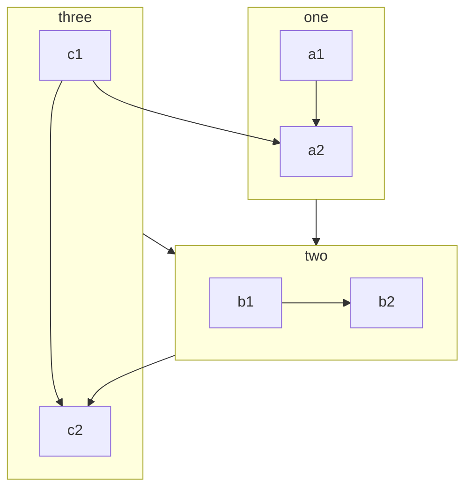

# mermaid
For more [examples](https://mermaid-js.github.io/mermaid/#/flowchart).

VSCode [extension](https://github.com/mermaid-js/mermaid/blob/develop/docs/integrations.md) can be found here.
## Todo List

1. First tabstop
2. A second tabstop
3. A third tabstop

Note Created: 2021-06-01

---

  - This is an idea for [[documentation]] of the [[pipeline]]s.

---


```mermaid
graph TD 
A[Hard] -->|Text| B(Round)
B --> C{Decision}
C -->|One| D[Result 1]
C -->|Two| E[Result 2]
click A "[[../journal/2021-06-01]]" "Tooltip text" %% comments
```



```mermaid
graph TB %% comments
  %% Entity[Text]
  ID-1[Node 1]
  ID-2[Node 2]
  ID-3(Node 3 <br> text)
  %% Entity--Entity
  ID-1---ID-2
  ID-1 --> ID-3
  %% Entity--Text--Entity
  ID-2--Link between 2 and 3---ID-3
  ID-3-->|Action from 3 to 1|ID-1
  ID-3 -- "Action from 3 to 2. p/w: '_-!#$%^&*+=?,\'" --> ID-2
  %% Complex cases
  A[Hard edge] -->|Link text| B(Round edge)
  ID-1---ID-2(Text)
  B --> C{Text}
  C -->|One| D[Text]
  A(A) --> B(B)
  C[/C/] --> D>D]
  %% class/classDef
  classDef blue fill:#08f,stroke:#fff;
  class ID-1 blue
  class ID-1,ID-2 red
  %% click
  click ID-1 "../journal/2021-06-01.md" "Tooltip text" %% comments
  click ID-2 alert "Tooltip for a callback"
  %% subgraph
  subgraph A Subgraph
    ID-4{Node 4}
    ID-5((fa:fa-spinner))
    ID-6["Node 6 (same #quot;shape#quot;)"]
    ID-4-.->ID-5
    ID-5 -. Action from 5 to 4 .-> ID-4
    ID-5==>ID-6
    ID-6 == Action from 6 to 5 ==> ID-5
  end
```